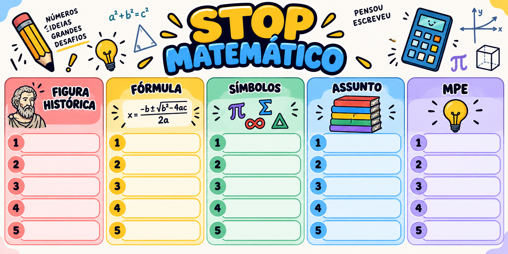

# STOP Matemático

O **STOP Matemático** é um jogo educativo para oficinas e aulas presenciais. A aplicação sorteia letras em uma roleta, controla o histórico da partida e oferece um banco de respostas para apoiar o educador durante a validação.

O jogo funciona diretamente no navegador, sem cadastro, instalação ou servidor. Depois de baixado, também pode ser usado sem internet.

## Acessar o jogo

[**Abrir o STOP Matemático no navegador**](https://nery-panoptes.github.io/stop-matematico/)

📱 **Também funciona no celular:** toque no link acima para abrir o jogo diretamente no navegador do telefone. Não é necessário instalar aplicativo nem fazer cadastro.

## Objetivo educacional

A atividade ajuda os estudantes a recordar, relacionar e explicar conhecimentos matemáticos de forma divertida. Durante as rodadas, eles mobilizam vocabulário, história da matemática, fórmulas, símbolos e conceitos, além de praticarem argumentação ao justificar suas respostas.

O sistema digital não substitui a folha: os participantes escrevem na cartela impressa enquanto a roleta é projetada para a turma.

## Cartela dos alunos

[**Clique aqui para abrir ou baixar a cartela**](./cartela-stop-matematico.png)

Para imprimir, escolha orientação **paisagem** e a opção **ajustar à página**. Entregue uma cartela para cada estudante ou grupo. A cartela possui cinco linhas, permitindo realizar cinco rodadas.

## O que preencher

| Categoria | O que o estudante deve escrever |
| --- | --- |
| **Figura Histórica** | Matemático ou pessoa historicamente relacionada à matemática. Pode valer prenome ou sobrenome, desde que a regra seja igual para todos. |
| **Fórmula** | Fórmula, relação, teorema, lei ou conceito ligado à letra. Fórmulas conhecidas de Física também podem ser aceitas. |
| **Símbolos** | Símbolo matemático reconhecido e relacionado à letra sorteada. |
| **Assunto** | Conteúdo, conceito, objeto ou área da matemática. |
| **MPE — Meu Professor É...** | Adjetivo que comece com a letra sorteada e complete a frase “Meu professor é...”. |

## Passo a passo para o educador

### Antes da atividade

1. Abra o jogo no navegador.
2. Conecte o computador ao projetor ou à televisão.
3. Imprima e distribua as cartelas.
4. Separe lápis ou canetas para os participantes.
5. Clique em **TELA CHEIA** para facilitar a visualização.

### Para começar a partida

1. Escolha um nível:
   - **Fácil:** A, C, E, F, M, P, S e T.
   - **Médio:** B, D, G, H, I, L, N e R.
   - **Difícil:** J, O e Q.
2. Mantenha marcada a opção **Não repetir letras na mesma partida**.
3. Explique rapidamente as cinco categorias da cartela.
4. Avise qual linha da cartela será usada naquela rodada: 1, 2, 3, 4 ou 5.

### Durante cada rodada

1. Clique no botão **GIRAR**.
2. Aguarde a roleta parar e anuncie a letra sorteada.
3. Os participantes devem preencher as cinco categorias na linha da rodada.
4. Combine previamente como a rodada termina: por tempo ou quando alguém completar e disser **STOP**.
5. Peça aos participantes que leiam suas respostas.
6. Use **RESPOSTAS POSSÍVEIS** se precisar de ajuda para conferir a letra atual.
7. Uma resposta que não esteja no banco ainda pode ser aceita se estiver correta e o participante conseguir explicá-la.
8. Passe para a linha seguinte da cartela e gire novamente.

### Botões úteis

- **RESPOSTAS POSSÍVEIS:** abre a ficha da última letra sorteada.
- **RESPOSTAS DO NÍVEL:** mostra todas as letras do nível atual.
- **COMO VALIDAR?:** apresenta critérios simples para conferir respostas.
- **REGRAS:** mostra as regras resumidas.
- **LIMPAR HISTÓRICO:** apaga apenas o histórico do nível atual.
- **REINICIAR PARTIDA:** limpa os históricos de todos os níveis.
- **SOM:** liga ou desliga os efeitos sonoros.
- **TELA CHEIA:** amplia o jogo para o projetor.

## Se estiver sem internet

1. Baixe o arquivo [`stopppp.html`](./stopppp.html) deste repositório.
2. Salve o arquivo no computador ou em um pendrive.
3. Abra o arquivo com dois cliques.
4. Se o computador perguntar qual programa usar, escolha Chrome, Edge, Firefox ou Safari.

Não é necessário instalar nenhum programa.

## Atalhos do teclado

- `Espaço`: girar a roleta.
- `1`: nível Fácil.
- `2`: nível Médio.
- `3`: nível Difícil.
- `F`: entrar ou sair da tela cheia.
- `R`: abrir as respostas da letra sorteada.
- `Esc`: fechar uma janela aberta.

## Agradecimentos

Um agradecimento especial aos meus colegas de curso, que foram de imensa importância para a realização e apresentação desta oficina. Cursamos **Matemática na Universidade de Brasília (UnB)** e estamos no **6º semestre**. O caminho na universidade seria muito mais difícil sem vocês. Obrigado pela parceria, pelas ideias e por todo o apoio :)

- **Felipe Silva de Lima**
- **Eric Abreu de Ferriche Bittencourt**
- **Arthur Guimaraes Amorim**
- **Lucas de Oliveira Santos**

## Créditos

Desenvolvimento web: **José Nery**  
Contato: [neryjose@proton.me](mailto:neryjose@proton.me)
